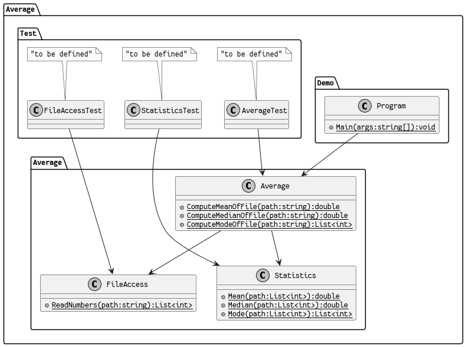

# Average

Computes _Mean_, _Median_, and _Mode_ of a series of numbers in a text file (separated by newlines).

Note: The code was written in a way that allows for improvements.

## Usage

Run tests:

    dotnet test

Run the demo program (using _mean_, _mode_, and _median_ on the file `data/numbers.txt`):

    dotnet run --project Average.Demo/ mean data/numbers.txt
    dotnet run --project Average.Demo/ median data/numbers.txt
    dotnet run --project Average.Demo/ mode data/numbers.txt

## Statistics

### Mean

The _mean_ is the sum of all elements, divided by the number of elements:

    x = [9, 4, 8, 3]
    mean(x) = sum(x)/length(x)
    sum(x) = 9 + 4 + 8 + 3 = 24
    length(x) = 4
    mean(x) = 24/4 = 6

### Median

The _median_ is the value in the middle of a sorted list of an odd number of elements. If the number of elements is even, the mean of the two elements in the middle is taken.

    x = [3, 4, 8, 12]
    median(x) = mean([4, 8])

    y = [3, 4, 8, 12, 23]
    median(x) = 8

### Mode

The _mode_ is the most common value in a list of numbers. It's possible that a list has multiple modes.

    x = [1, 2, 1, 2, 1, 3, 2, 3, 1]
    mode(x) = 1

    y = [1, 2, 3, 1, 2]
    mode(y) = [1, 2]